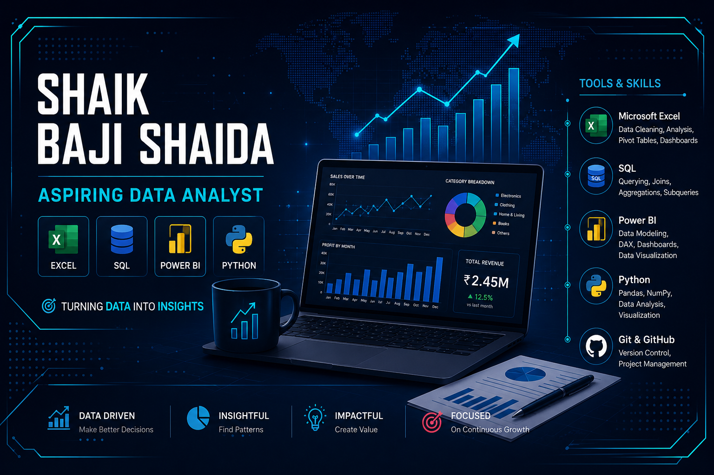

  

<h1 align="center">Hi 👋, I'm Shaik Baji Shaida</h1>
<h3 align="center">Aspiring Data Analyst | Excel • SQL • Power BI • Python</h3>

  

---

## 👨‍💻 About Me

- 📊 Aspiring Data Analyst passionate about solving business problems with data.
- 🎓 Final Year B.Tech Student.
- 🌱 Currently learning SQL, Tableau, Power BI and Python for Data Analytics.
- 📈 Interested in Data Visualization, Business Intelligence and Exploratory Data Analysis.
- 🚀 Building projects that turn raw data into actionable insights.

---

## 🛠️ Tech Stack

### Analytics

---

## 📊 GitHub Stats

---

## 🔥 GitHub Streak

---

## 📈 Contribution Graph

---

## 📂 Featured Projects

| Project | Description | Tools |
|---------|-------------|-------|
| 📰 Fake News Detection | Machine Learning web application for fake news classification | Python, Scikit-Learn |
| 📊 Sales Dashboard | Interactive sales dashboard with KPIs and business insights | Excel, Power BI |
| 🛒 Retail Sales Analysis | Sales trend and customer analysis | SQL, Power BI |
| 👥 HR Analytics Dashboard | Employee attrition and workforce insights | Power BI |
| 🎬 Netflix Data Analysis | Exploratory Data Analysis on Netflix dataset | Python, Pandas |
| 🧹 Data Cleaning Toolkit | Data cleaning and preprocessing using Python | Python, Pandas |

---

## 📚 Currently Learning

- Microsoft Excel
- SQL
- Power BI
- Python for Data Analysis
- Statistics
- Data Visualization

---

## 🌐 Connect With Me

---

<h3 align="center">
📊 Turning Data into Insights
</h3>
